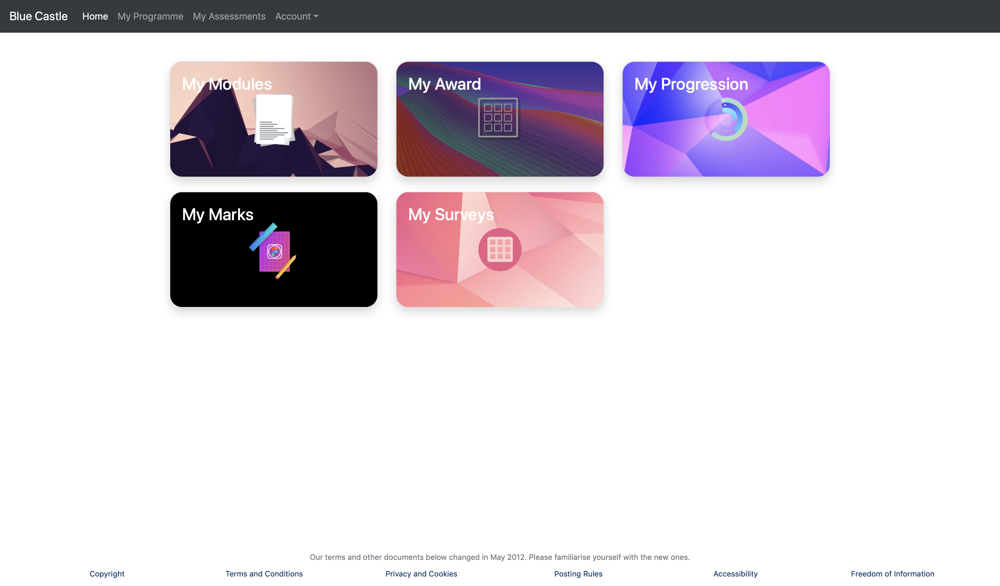
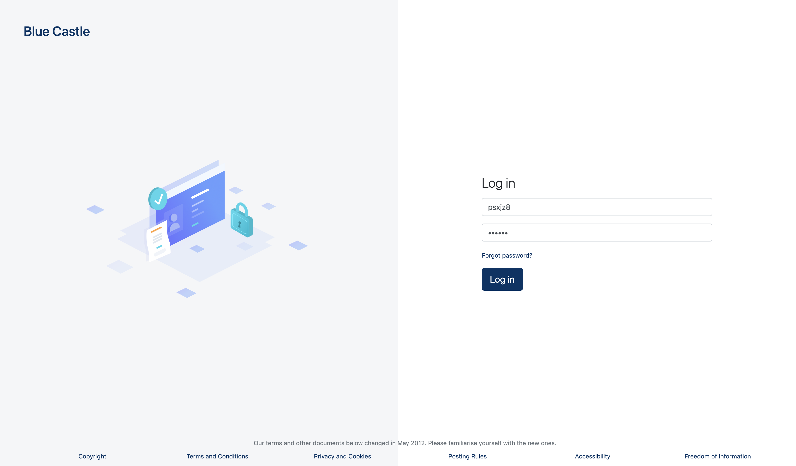
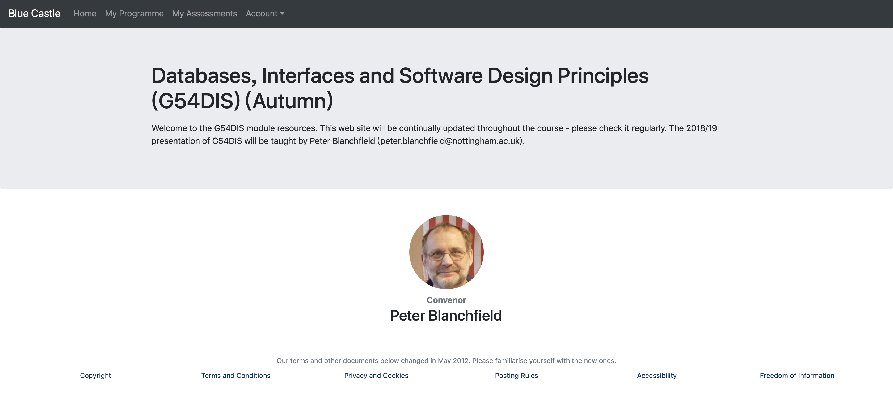

# Blue-Castle - Part six of G54DIS coursework
A module enquiry system that might be used in replacement for the Blue Castle interface.

## Screenshot

## Running the system
1. You can access the system through the link: http://mersey.cs.nott.ac.uk/~psxjz8/login.php or download and open the `index.php` or `login.php` file on a php server.

2. Login with default username(psxjz8) and password(123456).

## Features
* Login Page
* Home Page
* My Modules Page
* My Marks Page
* Module Information Page
* Log off function

## Author
Jiafu Zhang
